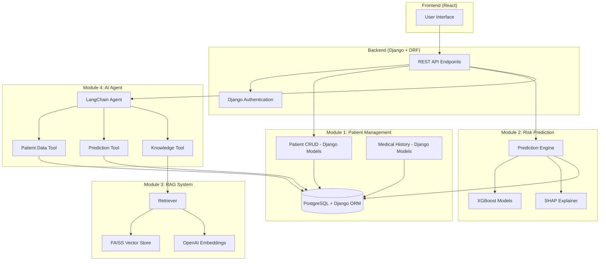

# Design Document

## Overview

The Clinical Decision Support System (CDSS) is a doctor-side application that assists healthcare professionals in clinical decision-making through a combination of ML risk prediction, explainable AI, medical knowledge retrieval, and AI-powered recommendations.

**This is a Final Year Engineering Project** - not a production enterprise application. The design prioritizes **simplicity, readability, and explainability** over scalability and optimization.

### Design Philosophy

The system follows a **simple, modular architecture** with four independent modules:

1. **Module 1: Patient Management** - Django-based CRUD for patient records and medical history
2. **Module 2: Risk Prediction** - ML-based disease risk assessment with SHAP explanations  
3. **Module 3: RAG System** - Medical knowledge retrieval using FAISS vector search
4. **Module 4: AI Agent** - Simple LangChain agent with three tools for recommendations

Each module is designed to be:
- **Independent**: Can be built and tested in isolation with STOP checkpoints
- **Simple**: Uses Django built-ins, minimal abstractions, straightforward implementations
- **Readable**: Clear naming and structure for academic presentation and viva explanations

### System Architecture Principles

1. **Use Django Features**: Django authentication, Django ORM, Django REST Framework - no custom implementations
2. **Clean Separation**: Each module has a single, well-defined responsibility
3. **Tool-Based Integration**: The AI Agent integrates modules through three simple tools
4. **Database-Centric**: PostgreSQL with Django ORM serves as the single source of truth
5. **No Unnecessary Features**: No account lockout, retry frameworks, connection pooling, complex error handling, property-based testing
6. **Academic-Friendly**: Code should be easily explainable to project evaluators

### Technology Stack

- **Backend**: Django + Django REST Framework (NOT Flask/FastAPI)
- **Frontend**: React
- **Database**: PostgreSQL with Django ORM
- **ML Framework**: XGBoost, SHAP, Joblib
- **AI/LLM**: LangChain (simple implementation), OpenAI API or Claude
- **Vector Store**: FAISS
- **Embeddings**: OpenAI Embeddings

## Correctness Properties

**Note**: These properties are simplified for academic focus. We will verify them through basic unit and integration tests, NOT property-based testing.

### Property 1: Authentication Using Django Built-ins

**Property**: The system must use Django's built-in authentication system without custom session management or account lockout.

**Validates: Requirements 1.1, 1.2, 1.3, 1.4, 1.5**

**Verification**: 
- Integration test: Login with valid credentials → verify Django session created
- Integration test: Login with invalid credentials → verify generic error message
- Integration test: Access protected endpoint → verify Django authentication required

**Why Important**: Leverages battle-tested Django authentication instead of reinventing the wheel

### Property 2: Risk Score Bounds

**Property**: All risk scores must be in range [0.00, 1.00] and correctly categorized (Low: 0-0.33, Moderate: 0.34-0.66, High: 0.67-1.00).

**Validates: Requirements 4.2, 4.3**

**Verification**:
- Unit test: Test categorization function with boundary values (0.33, 0.34, 0.66, 0.67)
- Integration test: Run predictions on test patients → verify all scores in valid range

**Why Important**: Risk scores represent probabilities; invalid values indicate computation errors

### Property 3: Data Integrity Using Django ORM

**Property**: Medical history, lab reports, predictions, and SHAP explanations must always link to valid patient/prediction records using Django foreign keys.

**Validates: Requirements 18.2, 18.3, 18.4**

**Verification**:
- Test Django model relationships work correctly
- Test Django enforces foreign key constraints

### Property 4: SHAP Explanation Consistency

**Property**: Top 10 SHAP features must be sorted by absolute SHAP value descending, and direction indicators must match sign (positive → increases risk, negative → decreases risk).

**Validates: Requirements 5.2, 5.5**

**Verification**:
- Unit test: Generate SHAP values → verify sorting and direction assignment
- Integration test: Generate prediction → verify SHAP explanations sorted correctly

**Why Important**: Incorrect explanations mislead doctors about risk factors

### Property 5: RAG Retrieval Returns Top 5

**Property**: RAG system must return top-5 most relevant excerpts.

**Validates: Requirements 7.2, 11.2**

**Verification**:
- Integration test: Query FAISS → verify 5 results returned
- Integration test: Verify results ordered by similarity score

**Why Important**: Doctors need the most relevant guidelines

### Property 6: AI Agent Tool Grounding

**Property**: AI Agent must call at least one tool before generating recommendations.

**Validates: Requirements 8.3, 8.4**

**Verification**:
- Integration test: Verify recommendations include tool call logs
- Test that agent prompt enforces tool usage

**Why Important**: Recommendations must be grounded in actual data, not hallucinated

### Testing Approach for Correctness Properties

**Note**: We use **simple unit and integration tests** - NOT property-based testing. The focus is on:

1. **Basic Unit Tests**: Test individual functions with clear examples
2. **Integration Tests**: Test module interactions with real database
3. **Minimal Test Coverage**: Focus on functionality, not 100% coverage (this is an academic project)

Each property is verified through straightforward test cases that can be easily explained during viva presentations.

## Architecture

### High-Level Architecture



### Technology Stack

- **Backend**: Python 3.9+, Flask
- **Frontend**: React, JavaScript
- **Database**: PostgreSQL
- **ML Framework**: XGBoost, SHAP
- **AI/LLM**: LangChain, OpenAI API
- **Vector Store**: FAISS
### Technology Stack

- **Backend**: Django 4.x + Django REST Framework (NOT Flask)
- **Frontend**: React
- **Database**: PostgreSQL with Django ORM
- **ML Framework**: XGBoost, SHAP, Joblib
- **AI/LLM**: LangChain (simple implementation), OpenAI API or Claude
- **Vector Store**: FAISS
- **Embeddings**: OpenAI Embeddings

### Data Flow

**Primary Workflow (Module-by-Module):**
1. **Module 1**: Doctor authenticates using Django authentication → registers/selects patient using Django ORM
2. **Module 1**: Doctor inputs medical history → stored in PostgreSQL via Django models
3. **Module 2**: Doctor requests prediction → XGBoost models compute risk scores + SHAP → stored via Django ORM
4. **Module 3**: System loads medical guidelines → chunks → embeddings → FAISS index (offline setup)
5. **Module 4**: Doctor requests AI recommendations → AI Agent calls 3 tools → LLM generates recommendation
6. **Module 4**: Doctor asks follow-up questions → AI Agent maintains simple context

**Module Development Order**: Must build Module 1 → STOP → Module 2 → STOP → Module 3 → STOP → Module 4

## Components and Interfaces

### Module 1: Patient Management (Django-based)

**Responsibility**: Handle all CRUD operations for patient demographics, medical history, and lab reports using Django.

**Django Models:**

```python
# Use Django's built-in User model for doctors
from django.contrib.auth.models import User

class Patient(models.Model):
    name = models.CharField(max_length=100)
    date_of_birth = models.DateField()
    gender = models.CharField(max_length=20)
    phone = models.CharField(max_length=20)
    email = models.EmailField()
    created_at = models.DateTimeField(auto_now_add=True)

class MedicalHistory(models.Model):
    patient = models.ForeignKey(Patient, on_delete=models.CASCADE)
    diagnoses = models.TextField()
    medications = models.TextField()
    allergies = models.TextField()
    notes = models.TextField()
    timestamp = models.DateTimeField(auto_now_add=True)

class LabReport(models.Model):
    patient = models.ForeignKey(Patient, on_delete=models.CASCADE)
    lab_data = models.JSONField()
    timestamp = models.DateTimeField(auto_now_add=True)
```

**Django REST Framework ViewSets:**
- `PatientViewSet`: Handles patient CRUD operations
- `MedicalHistoryViewSet`: Handles medical history storage and retrieval
- `LabReportViewSet`: Handles lab report storage and retrieval

**API Endpoints (using Django REST Framework):**
- `POST /api/patients/` - Create patient
- `GET /api/patients/` - List patients
- `GET /api/patients/{id}/` - Get patient details
- `PUT /api/patients/{id}/` - Update patient
- `POST /api/patients/{id}/history/` - Add medical history
- `GET /api/patients/{id}/history/` - Get medical history
- `POST /api/patients/{id}/labs/` - Add lab report
- `GET /api/patients/{id}/labs/` - Get lab reports

**Independence**: This module uses only Django built-ins. Zero dependencies on ML, RAG, or AI components.

### Module 2: Risk Prediction

**Responsibility**: Load ML models, compute disease risk predictions, generate SHAP explanations.

**Django Models:**

```python
class Prediction(models.Model):
    patient = models.ForeignKey(Patient, on_delete=models.CASCADE)
    disease_type = models.CharField(max_length=50)  # Diabetes, Heart Disease, Stroke
    risk_score = models.FloatField()  # 0.00-1.00
    risk_category = models.CharField(max_length=20)  # Low, Moderate, High
    timestamp = models.DateTimeField(auto_now_add=True)

class SHAPExplanation(models.Model):
    prediction = models.ForeignKey(Prediction, on_delete=models.CASCADE)
    feature_name = models.CharField(max_length=100)
    shap_value = models.FloatField()
    direction = models.CharField(max_length=20)  # increases_risk, decreases_risk
```

**Components:**

1. **ModelLoader** (Simple Python class)
   - Loads XGBoost models from `.pkl` files using `joblib.load()`
   - Returns None for any missing model

2. **RiskPredictor** (Simple Python class)
   - Takes patient features dictionary
   - Returns `{disease: {risk_score, risk_category}}`

3. **SHAPExplainer** (Simple Python class)
   - Uses `shap.TreeExplainer`
   - Returns top 10 features sorted by absolute value

4. **PredictionService** (Django service layer)
   - Orchestrates: get features → predict → explain → save to database using Django ORM

**Risk Categorization Logic:**
```python
def categorize_risk(risk_score):
    if risk_score < 0.34:
        return "Low"
    elif risk_score < 0.67:
        return "Moderate"
    else:
        return "High"
```

**Independence**: This module only depends on the database for storing results. Does not depend on RAG or AI Agent.

### Module 3: RAG System (Simple Implementation)

**Responsibility**: Load medical guidelines, generate embeddings, perform similarity search. Keep it simple.

**Components (All simple Python classes):**

1. **DocumentLoader**
   - Loads PDF or TXT files from a directory
   - Uses PyPDF2 or pdfplumber for PDFs
   - Basic file reading for TXT

2. **DocumentChunker**
   - Splits documents into chunks (simple character-based splitting)
   - Chunk size: ~1000 characters (not strict)
   - No complex overlap logic needed

3. **EmbeddingGenerator**
   - Uses OpenAI Embeddings API (`text-embedding-ada-002`)
   - Simple batch processing

4. **FAISSIndexManager**
   - Uses `faiss.IndexFlatL2` (simplest FAISS index type)
   - `build_index()` - creates index
   - `save_index()` and `load_index()` - persist to disk

5. **RAGRetriever**
   - `retrieve(query)` - returns top 5 relevant chunks
   - Simple similarity search, no complex filtering

**Offline Setup Script:**
```python
# build_rag_index.py - Run this once to create the FAISS index
documents = DocumentLoader.load_documents('data/guidelines/')
chunks = DocumentChunker.chunk_documents(documents)
embeddings = EmbeddingGenerator.generate_embeddings(chunks)
index = FAISSIndexManager.build_index(embeddings, chunks)
FAISSIndexManager.save_index(index, 'faiss_index.bin')
```

**Independence**: This module is completely independent. Does not depend on patient data, ML models, or AI Agent.

### Module 4: AI Agent (Simple LangChain Implementation)

**Responsibility**: Call 3 tools and let LLM generate recommendations. Keep it straightforward.

**Components:**

1. **Three Simple Tools** (LangChain Tool format):
   
   **PatientDataTool:**
   ```python
   def get_patient_data(patient_id):
       # Query Django ORM to get patient, medical history, lab reports
       # Return as JSON dictionary
   ```
   
   **PredictionTool:**
   ```python
   def get_prediction(patient_id):
       # Query Django ORM to get latest Prediction and SHAP explanations
       # Return as JSON dictionary
   ```
   
   **KnowledgeTool:**
   ```python
   def get_guidelines(query):
       # Call RAG retriever
       # Return top 5 guidelines as JSON
   ```

2. **Simple LangChain Agent:**
   ```python
   from langchain.agents import create_openai_functions_agent
   from langchain.prompts import ChatPromptTemplate
   
   tools = [PatientDataTool(), PredictionTool(), KnowledgeTool()]
   
   prompt = ChatPromptTemplate.from_messages([
       ("system", "You are a clinical decision support assistant. "
                  "You MUST use the tools to get patient data, predictions, and guidelines. "
                  "Generate: Clinical Summary, Risk Assessment, Recommendations, Next Steps."),
       ("user", "{input}"),
       ("assistant", "{agent_scratchpad}")
   ])
   
   agent = create_openai_functions_agent(llm, tools, prompt)
   ```

3. **RecommendationService (Django view or service):**
   - Call the agent with patient_id
   - Agent automatically calls tools
   - Return the LLM's response

**Simple Prompt Design:**

```
You are a clinical decision support AI assistant for doctors.

CRITICAL RULES:
1. You MUST call tools to retrieve data. NEVER generate answers without tool calls.
2. You MUST cite which tool provided each piece of information.
3. You MUST indicate that all recommendations are advisory and require doctor validation.

Available tools:
- PatientDataTool: Retrieve patient demographics, history, lab reports
- PredictionTool: Retrieve disease risk scores and SHAP explanations
- KnowledgeTool: Retrieve evidence-based clinical guidelines

Your response should include:
1. Clinical Summary (based on PatientDataTool)
2. Risk Assessment (based on PredictionTool, explain SHAP values)
3. Evidence-Based Recommendations (based on KnowledgeTool with citations)
4. Suggested Next Actions

Remember: You provide decision support. The doctor makes final clinical decisions.
```

**Integration**: This module depends on all previous modules but only through well-defined tool interfaces.

### Authentication Component

**Responsibility**: Secure doctor authentication with account lockout.

**Components:**

1. **AuthService**
   - `authenticate(username, password) -> session_token`
   - `create_session(doctor_id) -> session_token`
   - `validate_session(session_token) -> doctor_id`
   - `extend_session(session_token) -> success`
   - `terminate_session(session_token) -> success`

2. **AccountLockout**
   - Tracks failed login attempts per doctor
   - Locks account after 5 failures within 15 minutes
   - Lock duration: 30 minutes
   - Resets counter on successful login

3. **SessionManager**
   - Session duration: 30 minutes from last activity
   - Extends session on any user interaction
   - Terminates expired sessions

**Security Notes:**
- Passwords stored as bcrypt hashes
- Generic error messages (don't reveal if username exists)
- Session tokens: UUID v4
- Sessions stored in database with expiration timestamp

### REST API Endpoints

**Authentication:**
- `POST /api/auth/login` - Body: `{username, password}` → Returns: `{session_token}`
- `POST /api/auth/logout` - Header: `Authorization: Bearer <token>` → Returns: `{success}`

**Patient Management:**
- `POST /api/patients` - Create patient
- `GET /api/patients/{id}` - Get patient details
- `PUT /api/patients/{id}` - Update patient
- `GET /api/patients` - List all patients

**Medical History:**
- `POST /api/patients/{id}/history` - Store medical history
- `GET /api/patients/{id}/history` - Get medical history
- `POST /api/patients/{id}/labs` - Store lab report
- `GET /api/patients/{id}/labs` - Get lab reports

**Risk Prediction:**
- `POST /api/patients/{id}/predict` - Run prediction
- `GET /api/patients/{id}/predictions` - Get prediction history
- `GET /api/predictions/{prediction_id}` - Get specific prediction with SHAP explanations

**AI Recommendations:**
- `POST /api/patients/{id}/recommend` - Generate initial recommendation
- `POST /api/patients/{id}/followup` - Ask follow-up question, Body: `{question, conversation_history}`

All endpoints require authentication header except `/api/auth/login`.

## Data Models

### Patient Feature Schema

For risk prediction, the system expects patient features as a dictionary. The exact features depend on which disease model is being used:

**Common Features** (used across models):
- Age (integer)
- Gender (0=Female, 1=Male)
- BMI (float)
- Blood Pressure (Systolic, Diastolic)
- Cholesterol levels
- Glucose levels

**Feature Extraction:**
The `LabReportService` stores lab data as JSONB in PostgreSQL, allowing flexible schema. The `RiskPredictor` extracts required features from this JSONB field based on model requirements.

### Prediction Result Schema

```json
{
  "patient_id": 123,
  "timestamp": "2024-01-15T10:30:00Z",
  "predictions": [
    {
      "disease": "Diabetes",
      "risk_score": 0.72,
      "risk_category": "High",
      "shap_explanations": [
        {"feature": "glucose", "shap_value": 0.15, "direction": "increases_risk"},
        {"feature": "bmi", "shap_value": 0.08, "direction": "increases_risk"},
        {"feature": "age", "shap_value": -0.03, "direction": "decreases_risk"}
      ]
    },
    {
      "disease": "Heart Disease",
      "risk_score": 0.45,
      "risk_category": "Moderate",
      "shap_explanations": [...]
    },
    {
      "disease": "Stroke",
      "risk_score": 0.28,
      "risk_category": "Low",
      "shap_explanations": [...]
    }
  ]
}
```

### RAG Query Response Schema

```json
{
  "query": "guidelines for diabetes management",
  "results": [
    {
      "excerpt": "For patients with Type 2 diabetes...",
      "source_filename": "ADA_Diabetes_Guidelines_2023.pdf",
      "section_title": "Glycemic Control Targets",
      "similarity_score": 0.89
    },
    {
      "excerpt": "Metformin is recommended as first-line...",
      "source_filename": "ADA_Diabetes_Guidelines_2023.pdf",
      "section_title": "Pharmacological Interventions",
      "similarity_score": 0.84
    }
  ]
}
```

### AI Agent Tool Response Formats

**PatientDataTool Response:**
```json
{
  "patient_id": 123,
  "demographics": {
    "name": "John Doe",
    "date_of_birth": "1965-03-15",
    "gender": "Male",
    "phone": "555-0123",
    "email": "john.doe@example.com"
  },
  "medical_history": {
    "diagnoses": "Hypertension, Type 2 Diabetes",
    "medications": "Metformin 500mg, Lisinopril 10mg",
    "allergies": "Penicillin",
    "notes": "Patient reports occasional dizziness"
  },
  "lab_reports": [
    {
      "timestamp": "2024-01-10T09:00:00Z",
      "glucose": 145,
      "hba1c": 7.2,
      "cholesterol": 210,
      "blood_pressure": "140/90"
    }
  ]
}
```

**PredictionTool Response:**
```json
{
  "patient_id": 123,
  "timestamp": "2024-01-15T10:30:00Z",
  "diseases": [
    {
      "disease_name": "Diabetes",
      "risk_score": 0.72,
      "risk_category": "High",
      "shap_explanations": [
        {"feature": "glucose", "shap_value": 0.15},
        {"feature": "bmi", "shap_value": 0.08}
      ]
    }
  ]
}
```

**KnowledgeTool Response:**
```json
{
  "query": "diabetes management",
  "guidelines": [
    {
      "excerpt_text": "For patients with Type 2 diabetes...",
      "source_filename": "ADA_Guidelines_2023.pdf",
      "section_title": "Glycemic Control",
      "similarity_score": 0.89
    }
  ]
}
```


## Error Handling

### Error Handling Philosophy

The system follows a **fail-gracefully** approach with clear user feedback. All errors should:
1. Display user-friendly messages to doctors
2. Log technical details for debugging
3. Suggest corrective actions when possible
4. Never expose sensitive system internals

### Error Categories and Handling

**1. Authentication Errors**

| Error | User Message | System Action |
|-------|-------------|---------------|
| Invalid credentials | "Authentication failed. Please check your username and password." | Log attempt, increment failure counter |
| Account locked | "Your account is temporarily locked due to multiple failed login attempts. Please try again in 30 minutes." | Reject login, log event |
| Session expired | "Your session has expired. Please log in again." | Redirect to login page |

**2. Validation Errors**

| Error | User Message | System Action |
|-------|-------------|---------------|
| Missing required field | "Required field missing: {field_name}. Please provide this information." | Return 400 Bad Request, highlight field |
| Invalid format | "Invalid {field_name} format. Expected: {format_description}." | Return 400 Bad Request, show example |
| Length exceeded | "{field_name} exceeds maximum length of {max} characters." | Return 400 Bad Request |
| Duplicate patient | "A patient with this name and date of birth already exists. Patient ID: {id}. Would you like to view this record?" | Show warning, offer navigation |

**3. Database Errors**

| Error | User Message | System Action |
|-------|-------------|---------------|
| Connection failure | "Database connection error. Please try again." | Log error, return 503 Service Unavailable, enable retry button |
| Patient not found | "Patient record not found. Please verify the patient ID." | Return 404 Not Found |
| Foreign key violation | "Cannot complete operation. Referenced record does not exist." | Return 400 Bad Request, log details |
| Transaction failure | "Failed to save data. Please try again." | Rollback transaction, log error, enable retry |

**4. Model Loading Errors**

| Error | User Message | System Action |
|-------|-------------|---------------|
| Model file missing | "The {disease} prediction model is currently unavailable." | Log error, disable that disease prediction, continue with other models |
| Model corrupted | "The {disease} prediction model failed to load." | Log error, disable that disease prediction |
| All models failed | "Prediction service is currently unavailable. Please contact support." | Return 503, log critical error |

**5. Prediction Errors**

| Error | User Message | System Action |
|-------|-------------|---------------|
| Missing features | "Cannot generate prediction. Missing required data: {feature_list}. Please complete lab reports." | Return 400, list missing features |
| Invalid feature values | "Invalid lab value for {feature_name}. Expected range: {range}." | Return 400, show valid range |
| Prediction computation failed | "Failed to compute {disease} risk prediction. Other predictions may still be available." | Log error, store successful predictions, show partial results |
| SHAP explanation failed | "Risk prediction generated, but detailed explanation is unavailable for this prediction." | Store prediction without explanation, display warning |

**6. RAG System Errors**

| Error | User Message | System Action |
|-------|-------------|---------------|
| FAISS index missing | "Medical knowledge retrieval is currently unavailable." | Log error, disable Knowledge Tool |
| Embedding API failure | "Failed to process your query. Please try again." | Log error, return 503, enable retry |
| No results found | "No relevant clinical guidelines found for your query. Try rephrasing or broadening your search." | Return empty results with message |
| Query too long | "Query exceeds maximum length of 500 characters. Please shorten your question." | Return 400, show character count |

**7. AI Agent Errors**

| Error | User Message | System Action |
|-------|-------------|---------------|
| LLM API failure | "AI service temporarily unavailable. Please try again." | Log error, return 503, enable retry |
| Tool call failure | "Failed to retrieve {tool_name} data. Recommendation may be incomplete." | Log error, include failure note in response |
| All tools failed | "Cannot generate grounded recommendation. All data sources are currently unavailable." | Return error, suggest manual review |
| Response timeout | "AI recommendation generation timed out. Please try again." | Cancel operation after 30s, return 408, enable retry |
| No tool calls made | "Internal error: AI did not retrieve required data. Please try again." | Log warning (agent bypassed tools), return error |

### Error Response Format

All API endpoints return errors in consistent JSON format:

```json
{
  "success": false,
  "error": {
    "code": "VALIDATION_ERROR",
    "message": "User-friendly error message",
    "field": "field_name",
    "details": {
      "additional_context": "value"
    }
  },
  "timestamp": "2024-01-15T10:30:00Z"
}
```

**Error Codes:**
- `AUTH_FAILED` - Authentication failure
- `ACCOUNT_LOCKED` - Account temporarily locked
- `SESSION_EXPIRED` - Session expired
- `VALIDATION_ERROR` - Input validation failure
- `NOT_FOUND` - Resource not found
- `DATABASE_ERROR` - Database operation failure
- `MODEL_UNAVAILABLE` - ML model not available
- `PREDICTION_FAILED` - Prediction computation failure
- `RAG_UNAVAILABLE` - RAG system unavailable
- `AI_SERVICE_ERROR` - AI Agent/LLM failure
- `TIMEOUT` - Operation timed out
- `INTERNAL_ERROR` - Unexpected system error

### Logging Strategy

**Log Levels:**

- **ERROR**: System failures requiring attention (model loading failure, database connection failure, AI service errors)
- **WARNING**: Degraded functionality (partial prediction failure, SHAP explanation unavailable, no RAG results)
- **INFO**: Successful operations (login, prediction completed, recommendation generated)
- **DEBUG**: Detailed execution flow (tool calls, query processing, feature extraction)

**What to Log:**

1. **Authentication**: All login attempts (success/failure), account lockouts, session creation/termination
2. **Predictions**: Patient ID, disease types, success/failure status, execution time
3. **AI Agent**: Tool calls made, LLM API calls, token usage, response time
4. **Errors**: Full stack traces, request context, user ID, timestamp
5. **Performance**: Slow operations (>1 second for predictions, >3 seconds for RAG queries)

**What NOT to Log:**
- Passwords or session tokens
- Protected Health Information (PHI) beyond anonymized IDs
- API keys or secrets

**Log Format:**
```
[TIMESTAMP] [LEVEL] [MODULE] [USER_ID] - MESSAGE
2024-01-15T10:30:00Z INFO RiskPredictor doctor_123 - Prediction completed for patient_456: Diabetes=High, Heart=Moderate, Stroke=Low (duration: 0.8s)
```

### Retry Strategy

**Operations that support retry:**
- Database queries (transient connection issues)
- ML predictions (transient computation issues)
- RAG queries (transient API issues)
- AI Agent requests (LLM API rate limits)

**Retry Configuration:**
- Maximum retries: 3
- Backoff strategy: Exponential (1s, 2s, 4s)
- Retryable errors: Connection timeouts, 503 Service Unavailable, rate limits
- Non-retryable errors: 400 Bad Request, 401 Unauthorized, 404 Not Found

**User Experience:**
- Show loading indicator during retries
- Display "Retrying..." message after first failure
- After final failure, show error with manual retry button

## Testing Strategy

### Testing Philosophy

This system emphasizes **integration testing** and **example-based unit testing** over property-based testing because:

1. **Integration-Heavy**: Core functionality involves orchestrating external services (database, ML models, OpenAI API, FAISS)
2. **Non-Deterministic Components**: AI Agent responses vary based on LLM output
3. **External Dependencies**: Most operations require database, APIs, or pre-trained models
4. **Academic Focus**: Clear, demonstrable test cases that can be explained during project presentation

**Why Property-Based Testing (PBT) is NOT used:**

Property-based testing is inappropriate for this system because:
- Most code involves I/O and external service calls (database, ML models, APIs), not pure functions
- The AI Agent is non-deterministic (LLM-based)
- There are no universal properties that hold across infinite input spaces
- Core functionality is about integration orchestration, not algorithmic correctness

Instead, we use **snapshot tests** for configuration outputs, **schema validation** for data structures, and **mock-based tests** for external service interactions.

### Testing Levels

#### 1. Unit Tests

**Purpose**: Test individual functions and classes in isolation using mocks for external dependencies.

**Coverage Areas:**

**Module 1: Patient Management**
- `PatientService.create_patient()`: Test validation (required fields, length limits, duplicate detection)
- `PatientService.get_patient()`: Test retrieval, not-found handling
- `MedicalHistoryService.store_medical_history()`: Test storage with valid/invalid patient IDs
- Database schema validation: Test foreign key constraints, field types

**Module 2: Risk Prediction**
- `ModelLoader.load_models()`: Test handling of missing/corrupted model files
- `RiskPredictor.categorize_risk()`: Test risk thresholds (0.33→Low, 0.34→Moderate, 0.67→High)
- `SHAPExplainer.explain_prediction()`: Test feature extraction and sorting (mock SHAP library)
- Feature extraction from JSONB: Test mapping lab data to model features

**Module 3: RAG System**
- `DocumentChunker.chunk_documents()`: Test chunk size (500-1500 chars), overlap (100 chars), metadata preservation
- `RAGRetriever.retrieve()`: Test query length validation (1-500 chars), top-k retrieval (mock FAISS)
- Index persistence: Test save/load FAISS index

**Module 4: AI Agent**
- Tool response schemas: Validate JSON structure for PatientDataTool, PredictionTool, KnowledgeTool
- Tool error handling: Test each tool's error responses (patient not found, no predictions, RAG unavailable)
- Conversation context: Test maintaining last 5 messages in follow-up questions

**Authentication**
- `AuthService.authenticate()`: Test password validation, account lockout logic (5 failures → lock)
- `SessionManager`: Test session creation, expiration (30 min), extension on activity
- Password hashing: Test bcrypt hashing and verification

**Test Examples:**

```python
# Example: Risk categorization unit test
def test_categorize_risk():
    assert categorize_risk(0.20) == "Low"
    assert categorize_risk(0.33) == "Low"
    assert categorize_risk(0.34) == "Moderate"
    assert categorize_risk(0.66) == "Moderate"
    assert categorize_risk(0.67) == "High"
    assert categorize_risk(0.95) == "High"

# Example: Account lockout unit test (mock database)
def test_account_lockout(mock_db):
    auth_service = AuthService(mock_db)
    
    # Simulate 5 failed attempts
    for i in range(5):
        result = auth_service.authenticate("doctor1", "wrong_password")
        assert result.success == False
    
    # 6th attempt should be locked
    result = auth_service.authenticate("doctor1", "correct_password")
    assert result.success == False
    assert result.error_code == "ACCOUNT_LOCKED"
```

#### 2. Integration Tests

**Purpose**: Test module interactions with real dependencies (database, models, vector store).

**Test Environment:**
- PostgreSQL test database (Docker container)
- Pre-trained XGBoost models (small test models)
- Mock OpenAI API (for cost control)
- In-memory FAISS index (test data)

**Coverage Areas:**

**End-to-End Patient Flow:**
1. Create patient → Store medical history → Store lab report → Verify database state
2. Retrieve patient → Verify all linked data (history, labs) returned correctly
3. Update patient → Verify changes persisted

**Prediction Pipeline:**
1. Load models → Run prediction with sample features → Verify risk scores and categories stored
2. Generate SHAP explanations → Verify top 10 features stored with correct values
3. Handle missing model → Verify other disease predictions still complete

**RAG Pipeline:**
1. Load test documents → Chunk → Generate embeddings (mock) → Build FAISS index
2. Query index → Verify top 5 results returned with metadata
3. Handle empty results → Verify appropriate message returned

**AI Agent Integration:**
1. Call PatientDataTool → Verify correct database query and JSON response
2. Call PredictionTool → Verify most recent prediction retrieved
3. Call KnowledgeTool → Verify RAG system queried correctly
4. Generate recommendation (mock LLM) → Verify all tools called and response structured correctly

**Test Examples:**

```python
# Example: Prediction pipeline integration test
def test_prediction_pipeline_integration(test_db, loaded_models):
    patient_id = create_test_patient(test_db)
    store_test_lab_report(test_db, patient_id, sample_features)
    
    prediction_service = PredictionService(test_db, loaded_models)
    prediction_id = prediction_service.run_prediction(patient_id)
    
    # Verify prediction stored
    prediction = test_db.query(Prediction).filter_by(id=prediction_id).first()
    assert prediction.patient_id == patient_id
    assert 0.0 <= prediction.risk_score <= 1.0
    assert prediction.risk_category in ["Low", "Moderate", "High"]
    
    # Verify SHAP explanations stored
    shap_records = test_db.query(SHAPExplanation).filter_by(prediction_id=prediction_id).all()
    assert len(shap_records) <= 10  # Top 10 features
    assert all(hasattr(s, 'feature_name') and hasattr(s, 'shap_value') for s in shap_records)
```

#### 3. API Tests

**Purpose**: Test REST endpoints with realistic HTTP requests.

**Coverage Areas:**
- Authentication flow: Login → Get session token → Make authenticated request → Logout
- Patient CRUD: Create → Read → Update via API endpoints
- Prediction endpoint: Request prediction → Poll for completion → Retrieve results
- AI recommendation endpoint: Request recommendation → Verify response format → Ask follow-up

**Tools**: pytest with Flask test client

**Test Examples:**

```python
# Example: Authentication API test
def test_authentication_flow(client):
    # Login
    response = client.post('/api/auth/login', json={
        'username': 'test_doctor',
        'password': 'test_password'
    })
    assert response.status_code == 200
    token = response.json['session_token']
    
    # Authenticated request
    response = client.get('/api/patients', headers={
        'Authorization': f'Bearer {token}'
    })
    assert response.status_code == 200
    
    # Logout
    response = client.post('/api/auth/logout', headers={
        'Authorization': f'Bearer {token}'
    })
    assert response.status_code == 200
```

#### 4. Mock-Based Tests for External Services

**Purpose**: Test external service interactions without actual API calls.

**Mock Targets:**
- OpenAI API (embeddings, LLM completions): Use `unittest.mock` or `responses` library
- SHAP library: Mock `shap.TreeExplainer` to return controlled values
- LangChain agent execution: Mock tool calls and LLM responses

**Test Examples:**

```python
# Example: Mocking OpenAI embeddings
from unittest.mock import patch, MagicMock

@patch('openai.Embedding.create')
def test_rag_retrieval_with_mock_embeddings(mock_embedding):
    mock_embedding.return_value = {
        'data': [{'embedding': [0.1, 0.2, 0.3, ...]}]
    }
    
    rag_retriever = RAGRetriever(faiss_index)
    results = rag_retriever.retrieve("diabetes management")
    
    assert len(results) <= 5
    assert all('excerpt' in r and 'source_filename' in r for r in results)
    mock_embedding.assert_called_once()
```

#### 5. Schema Validation Tests

**Purpose**: Validate that data structures conform to expected schemas.

**Coverage Areas:**
- Database schema: Verify table definitions, foreign keys, data types
- API response schemas: Verify JSON structure matches documentation
- Tool response schemas: Verify PatientDataTool, PredictionTool, KnowledgeTool return expected JSON

**Tools**: `jsonschema` library for JSON validation, SQLAlchemy reflection for database schema

**Test Examples:**

```python
# Example: Validate PatientDataTool response schema
from jsonschema import validate

def test_patient_data_tool_schema():
    tool = PatientDataTool(mock_db)
    response = tool._run(patient_id=123)
    
    schema = {
        "type": "object",
        "properties": {
            "patient_id": {"type": "integer"},
            "demographics": {"type": "object"},
            "medical_history": {"type": "object"},
            "lab_reports": {"type": "array"}
        },
        "required": ["patient_id", "demographics", "medical_history", "lab_reports"]
    }
    
    validate(instance=response, schema=schema)  # Raises exception if invalid
```

#### 6. Error Handling Tests

**Purpose**: Verify that errors are handled gracefully and return appropriate messages.

**Coverage Areas:**
- Validation errors: Missing fields, invalid formats, length exceeded
- Database errors: Connection failure, not found, foreign key violation
- Model errors: Missing model file, prediction failure
- RAG errors: Index missing, no results, query too long
- AI Agent errors: Tool failure, LLM timeout, no tool calls

**Test Examples:**

```python
# Example: Test missing patient error
def test_get_nonexistent_patient(client, auth_token):
    response = client.get('/api/patients/99999', headers={
        'Authorization': f'Bearer {auth_token}'
    })
    assert response.status_code == 404
    assert response.json['error']['code'] == 'NOT_FOUND'
    assert 'not found' in response.json['error']['message'].lower()

# Example: Test account lockout
def test_account_lockout_after_5_failures(client):
    for i in range(5):
        response = client.post('/api/auth/login', json={
            'username': 'doctor1',
            'password': 'wrong_password'
        })
        assert response.status_code == 401
    
    # 6th attempt should be locked even with correct password
    response = client.post('/api/auth/login', json={
        'username': 'doctor1',
        'password': 'correct_password'
    })
    assert response.status_code == 403
    assert response.json['error']['code'] == 'ACCOUNT_LOCKED'
```

### Test Data Management

**Fixtures:**
- Sample patient records with demographics, history, lab reports
- Pre-computed predictions with SHAP values
- Small corpus of test medical guidelines (5-10 documents)
- Test XGBoost models (trained on sample data)

**Database Setup:**
- Use pytest fixtures to create/destroy test database per test session
- Use transactions with rollback for test isolation
- Seed test data before each test

**File Setup:**
- Test model files (`.pkl`) in `tests/fixtures/models/`
- Test documents for RAG in `tests/fixtures/documents/`
- Test FAISS index in `tests/fixtures/faiss_index/`

### Manual Testing Checklist

**For Academic Presentation:**

1. **Demo Scenario 1: New Patient Risk Assessment**
   - Login as doctor
   - Create new patient
   - Enter medical history and lab results
   - Run prediction → Show risk scores and SHAP explanations
   - Request AI recommendation → Show tool calls and grounded response

2. **Demo Scenario 2: Follow-Up Consultation**
   - Open existing patient with predictions
   - Ask AI: "What lifestyle changes would help reduce diabetes risk?"
   - Show Knowledge Tool retrieving guidelines
   - Ask follow-up: "What about medication options?"
   - Show conversation context maintained

3. **Demo Scenario 3: Error Handling**
   - Attempt prediction with missing lab data → Show clear error message
   - Simulate RAG system unavailable → Show graceful degradation
   - Show account lockout after failed logins

4. **Code Walkthrough:**
   - Show module independence (each module runs standalone)
   - Explain tool-based architecture (AI Agent calling tools)
   - Demonstrate SHAP explanation generation
   - Show RAG retrieval process

### Continuous Integration (Optional)

If time permits, set up GitHub Actions workflow:
1. Run all unit tests
2. Run integration tests (with Docker PostgreSQL)
3. Run API tests
4. Check code coverage (target: 70%+)
5. Lint code (flake8, black)

**CI Configuration:**
- Run on every push to `main` branch
- Run on pull requests
- Fail pipeline if tests fail or coverage drops below threshold

### Performance Testing (Optional)

**Load Testing Targets:**
- Patient creation: < 500ms per request
- Prediction generation: < 2s per patient (all 3 diseases)
- RAG query: < 3s per query
- AI recommendation: < 30s per request

**Tools**: Locust or Apache JMeter for load testing

**Test Scenarios:**
- 10 concurrent doctors creating patients
- 50 prediction requests over 1 minute
- 100 RAG queries over 1 minute

